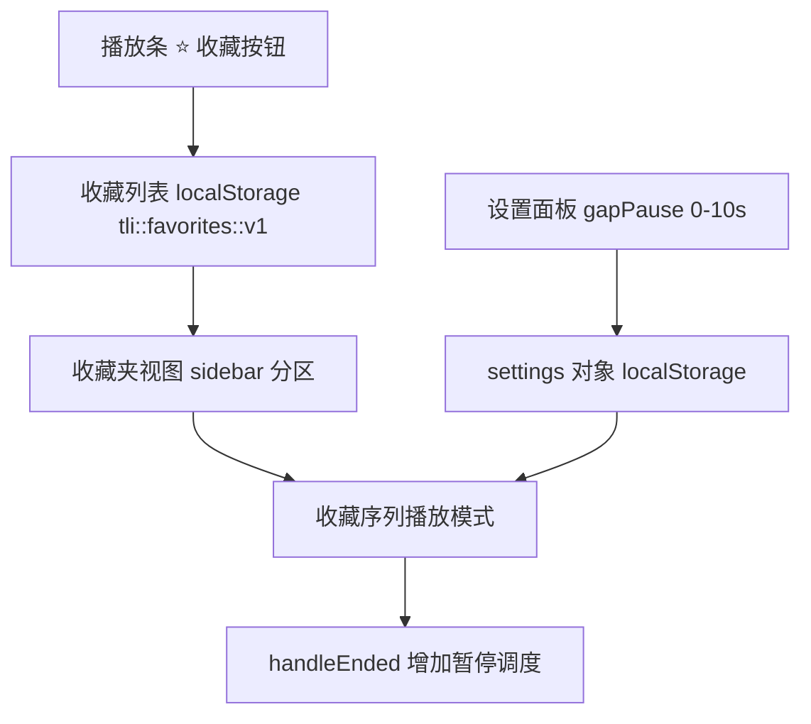

# 句间暂停与句子收藏（Sentence Favorites & Pause）

Feature Name: sentence-favorites-pause
Updated: 2026-08-11

## Description

在雅思考点词歌词播放器（tli/player.html，单文件纯前端）上新增两项能力：

1. **句间暂停**：设置面板新增可配置的句间暂停时长，播放顺序/随机序列时在句间插入等待，支持倒计时提示与跳过。
2. **句子收藏**：播放条新增收藏按钮；侧栏歌单支持"全部句子 / 收藏夹"视图切换；收藏句构成独立播放序列，循环精听。

## Architecture



- 保持单文件无依赖架构，新增逻辑全部内联于 player.html
- 收藏数据与设置继续使用 localStorage 持久化，键名 `tli::favorites::v1`
- 播放调度沿用现有 `handleEnded` 入口，追加暂停倒计时状态机

## Components and Interfaces

### 数据模型

```js
// 收藏条目（持久化）
{ id: Number, en: String, cn: String, keyword: String, meaning: String,
  voice: String, audio: String, ts: Number }

// 新增设置项
settings.gapPause = 1   // 句间暂停秒数，0-10，步进 0.5，默认 1
```

- `loadFavorites()` / `saveFavorites()`：收藏读写
- `isFavorite(id)`：判断是否已收藏
- `toggleFavorite(song)`：收藏/取消并反馈

### 句间暂停调度

- `handleEnded` 中当 mode 非 single 且 gapPause > 0 时进入 `scheduleNext(ms)`：
  - 倒计时期间音频静默、播放按钮可用（点击即跳过暂停立即播放下一句）
  - 在歌词区或播放条展示倒计时提示
  - 倒计时结束调用原 `playSong(reverse?prevIdx():nextIdx(), true)`
- single 单曲循环直接 `audio.play()` 不插入暂停

### 收藏夹视图

- 侧栏歌单顶部新增分段切换：`全部句子 | 收藏夹`
- 收藏夹视图渲染收藏句列表（按 ts 倒序），每行含收藏按钮（可取消）与序号
- 收藏夹顶部提供"▶ 播放收藏序列"按钮，点击进入收藏序列模式

### 收藏序列模式

- 进入后生成临时列表 `FAV_PLAYLIST`（按收藏顺序），遍历播放，句间应用 gapPause
- 播放中增删收藏时，下一句切换前基于最新收藏重新计算序列
- 收藏序列播完循环（Sequence 末句回第一句）

## Correctness Properties

- 收藏 id 唯一，取消收藏后从存储与视图同步移除
- 句间暂停倒计时期间切换播放（点歌/下一首/收藏序列）必须清理原倒计时，避免双播
- gapPause 设置即时生效（修改后无需刷新）
- 收藏序列为空时禁止进入播放，且给出提示

## Error Handling

- localStorage 不可用/损坏：收藏与设置读取回退为空值，写入静默失败（沿用现有 try/catch 模式）
- 暂停倒计时被清空（用户手动切歌）：清理定时器，不触发后续播放

## Test Strategy

- 使用 headless 浏览器自动化验证：
  1. 设置 gapPause=3 后点下一首，断言 3 秒后才开始播放且期间有倒计时提示
  2. 收藏/取消收藏按钮状态与 localStorage 一致性
  3. 收藏夹视图切换与空态显示
  4. 播放收藏序列：断言按收藏顺序播放、循环、句间暂停生效
  5. 单曲循环不插入句间暂停
  6. 暂停倒计时期间手动切歌不产生双播

## References

[^1]: (player.html#L576-L609) - playSong / handleEnded 现有播放调度入口
[^2]: (player.html#L383-L407) - settings 持久化模式
[^3]: (player.html#L456-L465) - 播放历史 localStorage 模式（收藏复用）
